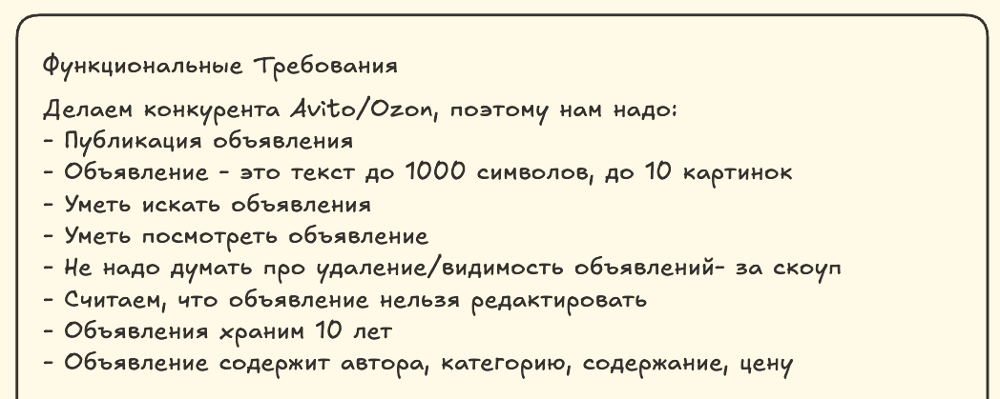
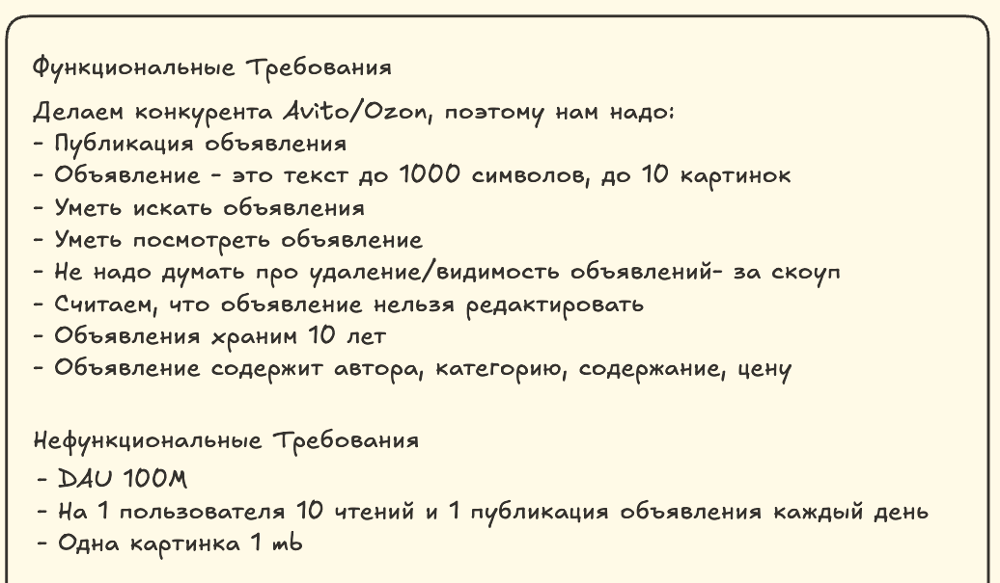
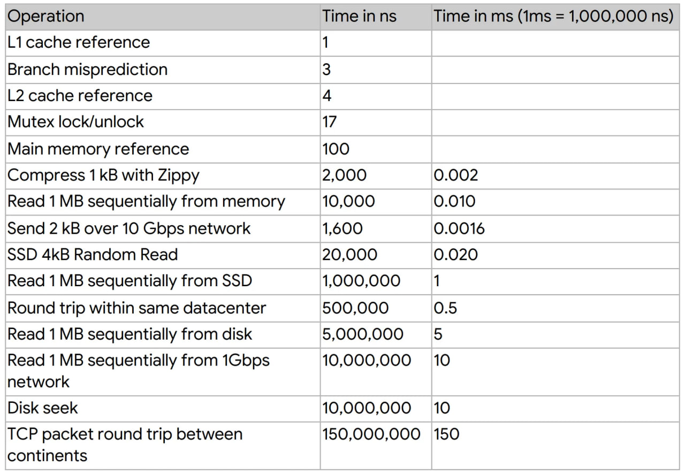
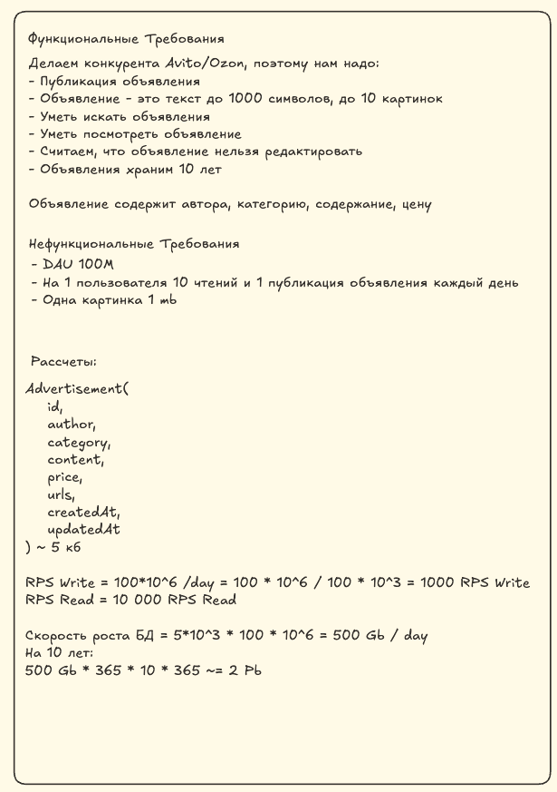
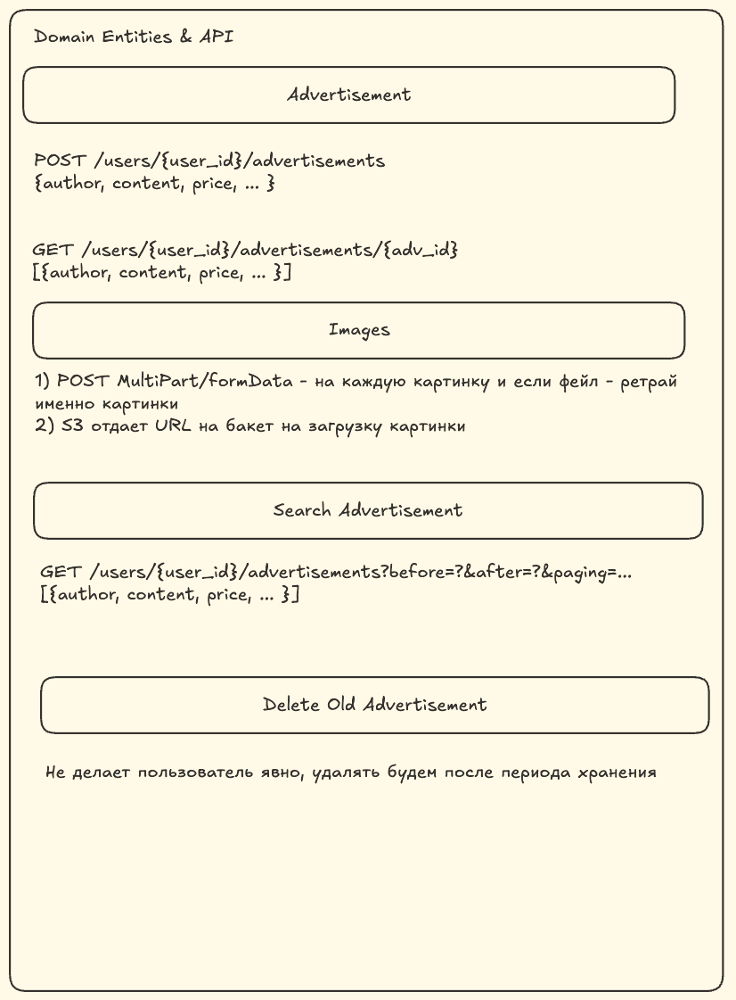
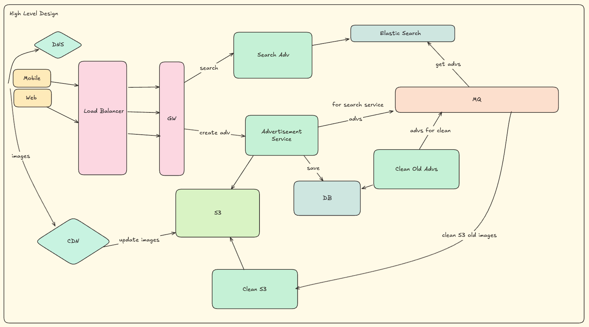
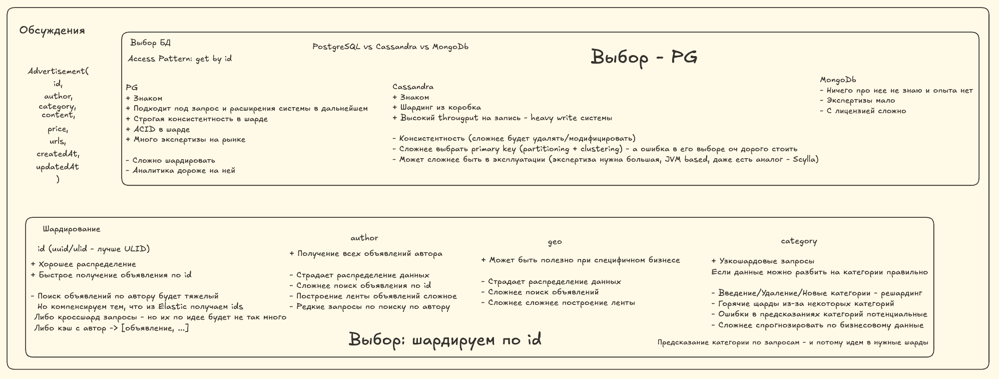
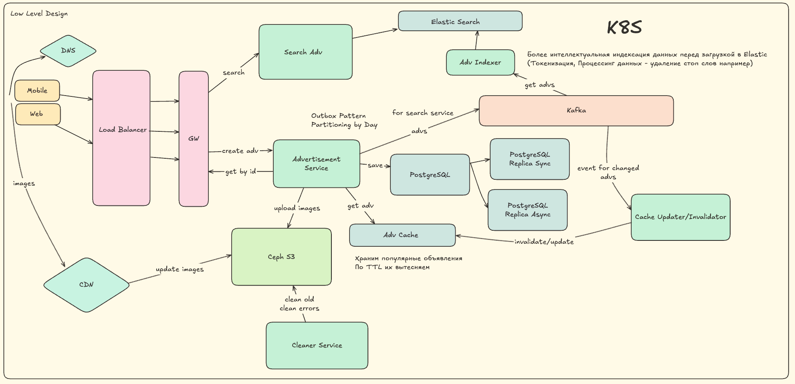
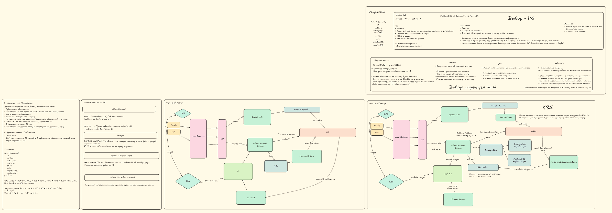

# Помощь в подготовке к System Design Interview

- [Помощь в подготовке к System Design Interview](#помощь-в-подготовке-к-system-design-interview)
    - [Введение](#введение)
    - [Структура](#структура)
        - [Требования](#требования)
            - [Функциональные требования](#функциональные-требования)
            - [Нефункциональные требования](#нефункциональные-требования)
            - [Итог по секции 'Требования'](#итог-по-секции-требования)
        - [Рассчеты](#рассчеты)
            - [Итог по секции 'Рассчеты'](#итог-по-секции-рассчеты)
        - [Domain Entities & API](#domain-entities--api)
            - [API](#api)
            - [Итог по секции 'Domain Entities & API'](#итог-по-секции-domain-entities--api)
        - [High Level Design (HLD)](#high-level-design-hld)
            - [Итог по секции 'HLD'](#итог-по-секции-hld)
        - [Low level design (LLD)](#low-level-design-lld)
            - [Итог по секции 'LLD'](#итог-по-секции-lld)
        - [Обсуждение](#обсуждение)
        - [Итог всех секций](#итог-всех-секций)
    - [Критерии оценки кандидатов](#критерии-оценки-кандидатов)
    - [Как подготовиться](#как-подготовиться)
        - [Книги](#книги)
            - [Алекс Сюй - System Design. Подготовка к сложному интервью](#алекс-сюй---system-design-подготовка-к-сложному-интервью)
            - [Мартин Клеппман - Высоконагруженные приложения. Программирование, масштабирование, поддержка](#мартин-клеппман---высоконагруженные-приложения-программирование-масштабирование-поддержка)
            - [The System Design Primer](#the-system-design-primer)
            - [Maarten van Steen - Distributed Systems 4th edition](#maarten-van-steen---distributed-systems-4th-edition)
        - [Youtube и Mock-интервью](#youtube-и-mock-интервью)
        - [Youtube и база](#youtube-и-база)
        - [ChatGpt и другие](#chatgpt-и-другие)
        - [Все состоит из кирпичиков](#все-состоит-из-кирпичиков)
        - [Общие советы](#общие-советы)
    - [Вывод](#вывод)
    - [Полезные ссылки](#полезные-ссылки)
    - [Отдельная благодарность](#отдельная-благодарность)

## Введение

System Design Interview - это один из видов собеседований, подразумевающих проектирование некоего компонента. Чаще всего это высоконагруженная система, описывающая достаточно большую предметную область. Например, вас могут попросить спроектировать Avito, Ozon, Youtube, Instagram и так далее.

В основном оно проходит в формате обсуждения ваших решений и соблюдение требований, попутно вы рисуете архитектуру в одном из инструментов, таких как draw.io, miro, excalidraw.

Собеседование чаще всего (хоть и не в ста процентах случаев) подразумевает некую структуру, ведь так или иначе любое такое собеседование можно разбить на этапы.

Почему важно придерживаться структуры?

Само собеседование подразумевает крайне сжатые сроки, около часа, при достаточно большой задаче, в которой обязательно будет какой-то челлендж от размера: большая нагрузка, много данных, различные сценарии и т.д. Обычно задача звучит как "Спроектируйте Facebook с миллиардом пользователей за 50 минут". При этом чаще всего интервьюер выступает в роли 'Заказчика', который просто верхнеуровнево что-то описывает в своих желаниях.

Чаще всего это выливается в то, что не подготовленный человек может растеряться, ждать наводящих вопросов от интервьюера, где-то слишком сильно уходить в детали, не синхронизироваться в понимании того, что именно надо сделать.

Во многих компаниях даже есть отдельный пункт: самостоятельность ведения проектирования. Т.е. от вас ждут (пусть и неявно), что вы будете вести себя как серьезный специалист: сами соберете или уточните требования, следите за временем, спрашиваете, если что-то непонятно, не молчите и рассуждаете прозрачно (вслух) и понимаете как достичь цели - понятной архитектуры системы.

Зачастую есть даже отдельные 'бонусы' в итоговой оценки для тех, кто успевает дойти до момента, когда можно не просто показать решение, а даже порассуждать о стоимости системы, о каких-то деталях реализации компонентов, вплоть до ЯП и Фреймворков.

Поэтому, чтобы не запутаться, не уйти раньше времени в детали и следить за временем вам нужна структура собеседования. И эта структура должна быть у вас в голове до начала прохождения собеседования.

Ну и для лучшей демонстрации мы будем рассматривать нашу структуру собеседования сразу на примере. И в качестве примера разберем сервис для публикации объявлений.

## Структура

Я рекомендую каждый блок оформлять рамкой для разделения границ и фиксации.

Итак, приступим к первому этапу.

### Требования

Итак, первый этап - это всегда сбор требований. На этом этапе вы, получив в общих чертах задачу, должны сформировать список требований к сервису, который вы будете проектировать.

Формирование списка происходит с помощью вопросов к интервьюеру. Не нужно стесняться, уточняйте любые вопросы - чем больше информации вы соберете, тем лучше.

Здесь надо сразу сделать оговорку, что иногда, для экономии времени, какие-то требования уже будут выписаны или предоставлены сразу. Это не всегда бывает так, но такое тоже встречается. И это не отменяет раздел сбора требований, просто сокращает его по времени.

Требования разделяются на функциональные и нефункциональные.

#### Функциональные требования

Функциональное требование (ФТ) — это заявление о том, как должна вести себя система. Они определяют то, что система должна делать, чтобы удовлетворить потребности или ожидания пользователя (постановки задачи). По сути это бизнес контекст задачи.

Пример ФТ:

* Возможность ставить лайки на фото
* Загрузка картинок
* Бесконечная лента для пользователя
* Пост может содержать и текст, и картинку

Что важно понимать?

Во-первых, чаще всего ФТ будут специально даны не полными и это ваша задача собрать их. При этом функицональне требования важно собрать еще и по той причине, что это напрямую влияет на архитектуру системы.

Во-вторых, даже если кажется, что все понятно - проговорите основные сущности и действия, а также то ли вы под ними понимаете, что имеет в виду интервьюер. Грубо говоря, синхронизируйте ожидания друг с другом.

Например, вы проектируете Twitter, и интервьюер говорит вам, что у пользователя должна быть возможность публиковать посты.

Здесь можно сразу спросить что такое пост? Это текст? Есть ли ограничения по размеру поста? Можно ли загружать картинки? Видео? Их количество в одном посте?

При этом, вы можете сами предлагать какие-то упрощения, главное это проговорить. Например, вы можете сослаться на то, что в Twitter ограничения в 255 символов, пусть и в нашей системе будет такое же.

Еще важно отметить следующий момент: зачастую некоторые компоненты не будут требоваться от вас в задаче, например, авторизация или аналитика. Но будет плюсом, если вы их явно проговорите и зафиксируете, что вы про это помните, но это за скоупом текущей задачи.

В нашем случае, мы получили следующие требования в начале задачи:

Проанализировав, задали следующие вопросы:

* Что входит в объявление?
* Какое количество фотографий может быть у объявления?
* Ограничения по тексту?
* Возможность удалять?
* Возможность редактировать?
* Сколько по времени храним объявление?
* Нужен ли функционал 'Сделать видимым/убрать с публикации'?

В итоге наши функциональные требования преобразились в:

#### Нефункциональные требования

Нефункциональные требования (НФТ) уже определяют то, как система должна работать технически и с какими техническими вызовами она столкнется (например, нагрузка, хранение данных, безопасность и т.д.).

Пример НФТ:

* DAU/MAU
* Количество пользователей через N лет
* Отношения операция записи/чтения
* RPS, сетевой трафик
* Безопасность

Что вы должны спросить обязательно и это потребуется почти в каждой задаче:

* DAU/MAU

    Понадобится при рассчете RPS, скорости роста объема данных

* Количество пользователей через N лет

    Понадобится для понимания размера храннимых данных и масштабировании

* Соотношение операция записи/чтения

    Понадобится при понимания heavy read или heavy write будет ваша система, а значит в выборе хранилища и разделения потоков данных (CQRS)

* Размер загружаемых данных

    Понадобится при выборе хранилища, протокола обмена и рассчетах. Например, договориться о среднем размере картинки.

* Как долго надо хранить данные

    Понадобится при выборе хранилища и рассчетах. Не забудьте умножить на фактор репликации или хотя бы упомнять это - будет плюсом!

Остальные НФТ уже более специфичны под задачу и предугадать, что это точно надо спросить сложнее.

В нашем случае, мы задали эти стандартные вопросы.

#### Итог по секции 'Требования'

В завершении этой секции у вас должны быть зафиксированы (как на доске, так и проговоерны с интервьюером) ФТ и НФТ.

Я обычно выделяю это в отдельную рамочку и для нешей задачи получилось что-то типа:

### Рассчеты

Собрав требования приступаем к подсчетам. Здесь надо примерно (не с высокой точностью) оценить трафик (количество запросов и их соотношение по чтение/запись), размер хранилищ и так далее. Эти рассчеты вы делаете на базе НФТ.

Попробуйте договориться о калькуляторе, иногда это допускается, но главное помните, что все рассчеты не требуют высокой точности, важно оценить порядок.

Прикидывайте все грубо, например, в сутках 86400 секунд - делите сразу на 100к. Если в вашей задаче вы загружаете пост с картинкой, то прикиньте примерный размер самого поста, при этом выбирайет размеры более простые для рассчетов. Например, не берите 1.5 mb на картинку - просто скажите 1 mb или 2 mb.

Для ускорения вычислений еще существуют всякие таблицы, их лучше помнить и использовать, так как на собеседовании вы много будете работать со степенями:

| Степень двойки | Приблизительно (в байтах)          | Название    | Сокращение |
|----------------|------------------------------------|-------------|------------|
| 2^0            | 1                                  | Байт        | 1 B        |
| 2^10           | ≈ 10³ = 1 024                      | Килобайт    | 1 KB       |
| 2^20           | ≈ 10⁶ = 1 048 576                  | Мегабайт    | 1 MB       |
| 2^30           | ≈ 10⁹ = 1 073 741 824              | Гигабайт    | 1 GB       |
| 2^40           | ≈ 10¹² = 1 099 511 627 776         | Терабайт    | 1 TB       |
| 2^50           | ≈ 10¹⁵ = 1 125 899 906 842 624     | Петабайт    | 1 PB       |
| 2^60           | ≈ 10¹⁸ = 1 152 921 504 606 846 976 | Эксабайт    | 1 EB       |

Тут полезно запомнить именно степени, что 10^6 байт - это мегабайт, в 9 - это гигабайт, в таком формате оценка порядка при рассчетах будет проще и легче.

Еще важно примерно представлять таблицу latency:

Она вам понадобится, если будут какие-то требования по времени доступа до функционала в вашей системе и для добавления новых компонентов в архитектуру, например, кэша.

В некоторых собеседоаниях одним из требований (или могут просто спросить) будет соблюдение SLA, поэтому тут также лучше просто примерно представлять табличку с числами доступности.

| Уровень сервиса | Время доступности (%)  | Максимальное время простоя в месяц | Максимальное время простоя в год |
|-----------------|------------------------|------------------------------------|----------------------------------|
| 99.999%         | 99.999%                | ~26 секунд                         | ~5 минут                         |
| 99.99%          | 99.99%                 | ~4.4 минуты                        | ~52.6 минут                      |
| 99.9%           | 99.9%                  | ~43.8 минут                        | ~8.76 часов                      |
| 99%             | 99%                    | ~7.31 часов                        | ~3.65 дня                        |
| 95%             | 95%                    | ~36.5 часов                        | ~18.25 дней                      |

Важно понимать, что это все надо представлять примерно, точности никто не требует.

#### Итог по секции 'Рассчеты'

В завершении этой секции у вас должны быть зафиксированы (как на доске, так и проговоерны с интервьюером) рассчеты по вашей системе.
Это и какие у вас RPS, и какой объем данных хранения, сколько вам нужно будет места для хранения данных и так далее.

Обычно после рассчетов я как бы завершаю секцию 'подготовки' к работе над задачей, поэтому следующую секцию выделяю отдельной рамкой.

### Domain Entities & API

Цель данной секции - это понять с чем именно будем работать (домены и сущности) и накидать какой-то API взаимодействия.

Для начала я советую выписать все сущности, задействованные в вашей системе по ФТ. Грубо говоря, обозначить домены, здесь же можно прямо явно обрисовать то, что вы проговорили с интервьюером и решили, что это не войдет в скоуп задачи.

Это поможет вам синхронизироваться с интервьюером, еще раз возможно что-то уточнить, нарисовать какие-то связи между сущностями.
Например, в случае мессенджера это может быть чат, пользователь, сообщение, клиент (мобильный или веб).

После перейти к следующему шагу, где вы спроектируете API взаимодействия вашей системы с пользователем.

По сути это последняя точка перед непосредственно проектированием.

В нашем примере можно выделить следующие домены: добавления объявления, получения ленты объявлений, получение объявления, поиск, загрузка фотографий, получение фотографий, удаление старых объявлений (кому более 10 лет).

#### API

Далее переходим к секции проектирования API.

При этом очень важно при выборе реализации обосновать ваш выбор. Выбираете REST API - поясните почему вы его выбираете, бегло можно пройтись по тому, что еще еще можно было бы использовать.

В нашем примере выбор пал на HTTP REST, в качестве аргументов я бы привел:

* Широко распространен
* Простота реализации
* Не требуется строго типизированный API
* Легко масштабируемый
* Объемы данных позволяют

Далее мы прошлись по каждому домену и набросали как это будет выглядеть.

Обратите внимание, что это именно примерный набросок, без детализации - не расписывается подробно пагинация, коды ответов и так далее.

Важно показать примерный ход ваших мыслей и подход, при этом при необходимости вы можете какой-то элемент рассмотреть чуть более подробно, например, поговорить о keyset пагинации и offset, обсудив плюсы и минусы.

#### Итог по секции 'Domain Entities & API'

В завершении этой секции у вас должно быть зафиксировано основное API взаимодействие и домены системы.

Для нашей задачи получилось так:

Следующую секцию я также выделяю отдельной рамкой, так как это уже непосредственно будет архитектурная схема.

### High Level Design (HLD)

Эта секция - это точка, в которой вы должны нарисовать примерную, верхнеуровневую архитектуру проектируемой системы.

Я обычно рисую схему от пользователя, клиента (мобильного или веб),далее идет некий прямоугольник как абстрактная точка входа в систему. Обычно это балансировщик нагрузки (Load Balancer).

После этого можно начать рисовать потоки данных (запросы), которые пользователь шлет по доменам.

Например: создание объявления, получение ленты объявлений, загрузка медиа.

Основной совет тут - это не уходите в детали, не выбирайте конкретные реализации, а просто накидываете как мазками первые штрихи. Оперируйте абстракциями: рисуйте не PG или Cassandra, а прямо так и подпишите - БД, а потмо уже вы будете делать выбор что это за БД будет. Здесь скорее важно выделить блоки о которых пойдет речь далее и их вы уже спроектируете более глубоко.

При этом важно обговорить, что у вас будет предусмотрена шардирование, репликация, но как это будет сделано вы рассмотрите чуть позже (в следующей секции).

Почему это важно? Все просто, так как времени мало и действительно можно многое не успеть, велик риск 'закопаться' в деталях и не успеть дорисовать схему. Ведь в таких системах, наподобие, Facebook, Instagram и прочее деталей миллион. А схема - это тот самый артефакт, который остается у интервьюера и будет оцениваться, причем, возможно, и другими. Поэтому это очень важный шаг, что есть рабочее решение (пусть пока и абстрактное).

Банально, если вы закопаетесь где-то и вам не хватит времени в детализации у вас хотя бы будет завершенная верхнеуровневая схема, а это уже будет плюсом.

Советы тут следующие:

* Рисуйте сначала так, будто это в одном датацентре располагается

    Зачастую тема cross DC крайне сложна и полна подводных камней, поэтому лезть туда даже при необходимости (когда вы понимаете по НФТ это) надо только под конец

* Не используйте то, чего не знаете или плохо представляете как работает

    Использование инструмента, которым вы не владеете - может разрушить все представление о вас и дать негативный окрас собеседованию. Так как вы все равно пойдете в детали (в следующей секции), то это потенциально место, где вы засыпетесь или не предусмотрите подводные камни, которые разрушат вашу систему.

    Как сказал мой приятель "Еще ни разу не нанимали человека, который предложил MongoDB".

    Если вы работали только с PostgreSQL, но вам кажется, что здесь подошло бы NoSQL решение, то лучше выбрать знакомый вариант, но подсветить, что можно попробовать другое решение (назвав его), однако выбор не в его пользу по причине того, что вы не имели опыт работы с ним или плохо его знаете.

* Если в задаче есть место blob-ам (картинки, видео, музыка), то значит вам уже можно сразу нарисовать CDN и S3

    При этом распространеной ошибкой является не понимание S3 и возможности, например, грузить по ссылке напрямую в него.

* Если вам нужно как-то передавать данные в другие системы или асинхронно, то скорее всего можно рисовать очередь

    Выбор очереди делайте в конце, пока просто обрисуйте само взаимодействие.

* Сразу можно в heavy read системы нарисовать кэш

    Но знайте, что это автоматически будет вести к вопросам про инвалидацию кэша, про непопадания в кэш и так далее

* Старайтесь подписывать стрелки взаимодействия

* Циклические связи между сервисами - чаще всего это плохо

    Если между сервисами начинаются циклические связи (когда сервис 1 ходит в сервис 2, а сервис 2 ходит в сервис 1) - это метрика, чтобы подумать как переделать взаимодействие, например, через ту же очередь и событийную модель

#### Итог по секции 'HLD'

В завершении этой секции у вас должно быть зафиксировано верхнеуровневая схема.

Также помните, что в следующей секции ваша схема может усложниться или там могут появиться дополнительные детали.

Для нашего примера итог High Level Design:

Заметьте, что на этом этапе схема еще не имеет конкретики, но уже есть неплохой чекпоинт!

### Low level design (LLD)

Здесь уже более детально проходим по схеме и выбираем реализации компонентов.

Обязательно рассуждайте вслух и проговаривайте почему выбираете то или иное решение, при этом в идеале проговаривать и минусы своего выбора.

Например, вы выбрали реляционную БД и взяли PostgreSQL, объясните почему этот выбор такой: вам нужны связи между сущностями? Вам необходимы ACID транзакции? Все это проговаривайте.

Обязательно подробнее остановитесь на шардировании данных, так как почти наверняка данных по задаче у вас будет много. Взвесьте разные варианты, я обычно выделяю отдельный блок под такие рассуждения и расписываю разные варианты:

Каждому варианту напишите минусы и плюсы, сопоставьте с ФТ - важно, чтобы интервьюер увидел рассуждения и что вы не просто так делаете выбор.

Если вы добавляете кэш, то будет правильно и посчитать его размер, обговорить что именно там будет храниться. Если в вашей схеме есть отправка в очередь и запись в базу - сразу подумайте о гарантиях доставки и каком-нибудь Outbox Pattern-е.

#### Итог по секции 'LLD'

В завершении этой секции у вас должна быть зафиксировано схема с деталями реализации.

В нашем примере это:

### Обсуждение

Если вы дойдете до обсуждения и вопросов, то это будет дополнительным плюсом.

Здесь уже скорее всего вы будете обсуждать более детально как будет вести себя система при сбоях, как вы будете делать реплики данных, что выберете в качестве среды для эксплуатации и т.д.

В нашем примере мы обсудили Transcational Outbox Pattern, что будем партиицровать по дням и потом удалять только данные.
Поговорили про инвалидацию кэша и закончили обсуждеие 'пошатав' и помоделировав сбои в системе, а также как она себя при этом поведет.

### Итог всех секций

По итогу у вас должна быть схема, расписанные блоки и аргументированный выбор компонентов, итоговая схема:

## Критерии оценки кандидатов

Понятно, что каждая компания оценивает кандидатов по своему. Да и вообще, будем честны, зачастую здесь важно еще и что за человек ведет это интервью.
Но все же попробуем накидать (очень примерно) некоторые критерии, ориентируясь на которые можно более менее обще представить как происходит оценка:

* Формализация задачи

    По сути это про то, насколько кандидат понял что надо сделать и какие к его системе предъявлялись требования, насколько он их собрал.

    Сюда же входят и границы системы, т.е.то, что вы проговорили/подсветили, но это не вошло в скоуп задачи.

* Самостоятельность ведения интервью

    Насколько у вас есть план, насколько вы понимаете как вы будете решать поставленную задачу за короткий промежуток времени.

    Т.е. тут будет оценено уложились ли вы во время, приходилось ли интервьюеру вас 'возвращать' так как вы ушли в дебри, как следили за таймингом.

    Здесь на самом деле очень сильно зависит от интервьюера 

* Принятие решений

    Насколько вы обосновываете принимаемые решения и выбор технологий.

    Здесь будет оценено как вы выбираете реализацию для компонента, какие варианты предлагали, рассматривали ли плюсы и минусы, как аргументировали свой выбор.

    Например, я видел интервью, где проектировали социальную сеть и предложили Neo4J как графовую БД для связей пользователей, на вопрос почему сказали "Ну это всегда так выбирается для соц. сетей", после же оказалось, что человек не знал что это и как работает. После вопроса о масштабировании предложил отказаться и выбрать PostgreSQL. Надо ли говорить, что это сильно смазало впечатление об интервью?

* Завершенность

    На сколько задача завершена, какие остались артефакты по ней, что получилось обсудить.

    Сюда входит также и тот самый блок ответов на вопросы, успели ли 'пошатать' систему и т.д.

* Масштабирование под нагрузку

    Насколько спроектированная система масштабируема, держит нагрузку и различные фейл ситуации

* Читаемость

    Обычно про это не говорят, но это точно один из критериев (пусть и субъективный) оценки. Он говорит о том, насколько читаема схема, то есть пригодна для передачи информации другим людям.

* Метрики

    Какие метрики вы предложили. Причем тут от вас будут ждать как технические, так и продуктовые метрики.

    Обычно это обсуждается уже в конце, но надо понимать, что иногда инициацию этого разговора ждут именно от вас.

Важно понимать, что это примерные, хоть и часто встречаемые критерии.

## Как подготовиться

### Книги

#### Алекс Сюй - System Design. Подготовка к сложному интервью

Зачастую, когда говорят о таких интервью всегда советуют книжку Алекса Сюя «System Design. Подготовка к сложному интервью».

Я бы также рекомендовал эту книгу, но с одной оговоркой: эту книгу воспринимайте именно как введение. Эта книга написана в стиле High Level Design, т.е. там очень мало деталей (которые у вас как раз спросят), но много тем о которых надо поговорить и подумать.

Я бы посоветовал к этой книге еще посмотреть [Подкаст { между скобок } - System Design Interview, Alex Xu](https://www.youtube.com/watch?v=H9sIm43PzlM&list=PLlghaO_0b1OcY4yfpwGUOcFlnU7LpIkhC). Читаете главу - смотрите разбор главы. Это будет полезнее и многие подводные камни там подсветят.

И читайте новое издание именно, оно более полное.

#### Мартин Клеппман - Высоконагруженные приложения. Программирование, масштабирование, поддержка

Неплохая книга, но я бы сказал, что эта книга должна быть вами уже прочитана. Я бы не сказал, что она прямо сильно поможет вам пройти System Design, но позволит именно задуматься о базовых вещах.

Если вы уже матерый сеньор или давно в разработке, то, как мне кажется, эта книга не так много вам даст. Просто по причине того, что многие вещи будут вам уже давно знакомы.

Точно также, как и с предыдущей книгой, на YouTube есть разбор книжки (но неполный): [Владимир Невзоров - Разбор книги Клеппмана](https://youtube.com/playlist?list=PLsvdqJRjAOZstptcYolYA12Mv96q5rwT0&si=q5RauwcA_2m46N0k).

В общем, читать ее стоит, но скорее для кругозора общего и именно базы. При этом не все темы там разобраны хорошо. Поэтому я бы если и рекомендовал эту книгу для прочтения, то для Junior/Middle. Но не для Senior и выше.

Если вы хотите в негативном свете взглянуть на эту книгу, то есть [отзыв](https://habr.com/ru/articles/868010/). Я привожу его как просто ссылку на иное мнение и не более.

#### The System Design Primer

Также из того, что можно почитать нельзя пройти мимо [System-design-primer](https://github.com/donnemartin/system-design-primer/tree/master).

Это, конечно, не совсем книга, а такой сборник на github различных разборов, примеров и прочего.
С огромным количеством ссылок и прочего.

Посмотреть стоит.

#### Maarten van Steen - Distributed Systems 4th edition

Книжка бесплатная, очень много теории, я бы сказал, что это также больше про базовые знания. Этакий аналог книжки с кабанчиком.

Ссылка: [Distributed Systems 4th edition](https://www.distributed-systems.net/index.php/books/ds4/)

### Youtube и Mock-интервью

Обязательно смотрите чужие решения и разборы! Я считаю, что это отличный вариант по цене/качеству при подготовке к интервью.

Тут, разумеется, есть подводный камень - это то, что хороших интервью крайне мало. Youtube завален видео "System Design Instagram" за 5 минут.
Такие видео пользы не имеют и смотреть их не надо.

Рекомендую для начала посмотреть статью [Олега Стрекаловского - Приручая System Design Interview. Как его организовать и как к нему подготовиться](https://habr.com/ru/articles/698734/), где он дает ссылки на многие интересные собеседования (и дает оценку им).

Я бы для подготовки посоветовал посмотреть прежде всего Евгений Афанасьева:

* [Евгений Афанасьев - System Design LeetCode / TeamLead Avito](https://www.youtube.com/watch?v=eRUHvOJsGwk)
* [Евгений Афанасьев - System Design Youtube / TeamLead Avito](https://www.youtube.com/watch?v=L9Lt0KEPcDc)

На мой взгляд очень качественно и ровно то, что нужно. Также в самом конце в Полезных материалах я приведу ссылку на его канал.

Еще стоит посмотреть следующеи материалы:

* [Канал it-interview](https://www.youtube.com/@it-interview2055)
* [Канал Hello Interview - SWE Interview Preparation](https://www.youtube.com/@hello_interview)

    В дополнении еще можно пробежаться по [System Design in a Hurry Introduction](https://www.hellointerview.com/learn/system-design/in-a-hurry/introduction) - методичке для FAANG'овских систем дизайнов.

* [Подкаст { между скобок } - System Design](https://youtube.com/playlist?list=PLlghaO_0b1OcOrOX7hn_wy1cgSS8NULLc&si=iko7wNprfHtetfo9)

### Youtube и база

Если же нужно более базовые вещи по темам:

* [Владимир Балун - System Design](https://youtube.com/playlist?list=PL_5NbJ27RRd1geLpuexvaSkAEPpprhE8i&si=P4nGlTC4tuSfmlQL)
* [Олег Бунин на ФПМИ - Highload (4 курс, весна 2021)](https://youtube.com/playlist?list=PL4_hYwCyhAvYyx4TIRk6tLG0c8CLGzhE5&si=l3gmLFQfmIstBykZ)
* [Олег Бунин на ФПМИ - Highload (4 курс, весна 2022)](https://youtube.com/playlist?list=PL4_hYwCyhAva6-f-YxobKju-6ltmn-jNC&si=jixfeMY9enL89fj1)
* [Курс TFTDS Романа Липовского на ФПМИ](https://youtu.be/Wmik-yspNY4)

### ChatGpt и другие

В рамках подготовки можно также попробовать разобрать некоторые задачи (или попросить сгенерировать условия) с ИИ, например, chatGPT.

Однако помните, что из любой ИИ надо прямо 'выбивать' краевые случаи и нередко они их пропускают, не говорят про детали.

Поэтому внимательно следите за тем, что именно предлагает ваш ассистент, обязательно спрашивайте что-то в формате 'А как пользователь получит картинку? А если будет большая нагрузка?' и так далее.

Например, попросите спроектировать чат между двумя пользователями и вы заметите, что то, как пользователь поймет, что ему отправили сообщение просто будет пропущено. Т.е. chatGPT спроектирует только как данные придут на сервер и сохранятся.

### Все состоит из кирпичиков

Все задачи, на самом деле, состоят из более маленьких задач - из кирпичиков. И если вы научитесь хорошо проектировать и использовать эти кирпичики, то и более глобальные задачи не будут настолько сложны.

Что я подразумеваю под кирпичиками?

Грубо говоря, большая часть задач так или иначе включает (или может включать) следующие компоненты: S3, ID Generation, K/V Storage, Consistent hashing, News/Post Feed, Rate Limiter, Chat, RDBMS, GeoHash.

И понимая как спроектировать или как работает каждый из них, зная плюсы/минусы - можно собрать почти любую систему.

Отсюда главый совет - это начать разбор и погружение в System Design вот с таких задач-кирпичиков.

### Общие советы

Важно понимать, что многие вопросы, которые будет задавать вам интервьюер или то, на что он будет более остро реагировать, зависит от компании и человека. Например, задачку пример из этой статьи мы проговаривали с ребятами, которые делают поиск и у них даже реакция на слово 'поиск' ярко выражена. Точно также, кто-то из Яндекс.Облака будет скорее всего более внимательно смотреть/спрашивать про DNS и отказоустойчивость.

Попросите кого-то (друга, приятеля) провести с вами Mock-интервью. Одно дело вы читаете книги, смотрите чужие решения и кажется, что вы уже готовы и совсем другое, когда вы оказываетесь один на один с чистым холстом и парочкой функциональных требований.

Еще советую ознакомиться с советами [Валерия Овчинникова](https://t.me/quant_valerian/672).

## Вывод

Секция System Design - это достаточно сложная секция, в которой за ограниченный период времени необходимо спроектировать достаточно сложную систему.

Для успешного прохождения вам так или иначе нужно будет выработать структуру, по которой вы пойдете и будете следить за временем каждого из этапов. Помните, что к следующей секции следует переходить только после завершения предыдущей.

Старайтесь раньше времени не уходить в детали, так как именно там может быть потеряно время и вы не успеете даже High Level Design сделать.

Не используйте то, что не знаете или в чем не уверены.

Обязательно проговаривайте свои решения и больше рассуждайте.

Изучайте чужие решения и обязательно практикуйтесь сами!

## Полезные ссылки

1. [Дмитрий Волыхин — System Design-интервью для практиков](https://www.youtube.com/watch?v=RAMWRgt-3G0)
2. [Александр Поломодов - Обзор фреймворка для прохождения интервью из книги “System Design Interview: An Insider’s Guide”](https://tellmeabout.tech/review-four-step-framework-from-system-design-interview-insider-guide-17e274ec14c)
[Александр Поломодов - System Design Interview и как к ним подготовиться](https://tellmeabout.tech/preparation-for-system-design-interview-66489d7a0af6)
3. [Олег Стрекаловский - Приручая System Design Interview. Как его организовать и как к нему подготовиться](https://habr.com/ru/articles/698734/)
4. [Подкаст { между скобок } - System Design Interview, Alex Xu](https://www.youtube.com/watch?v=H9sIm43PzlM&list=PLlghaO_0b1OcY4yfpwGUOcFlnU7LpIkhC)
5. [Владимир Невзоров - Разбор книги Клеппмана](https://youtube.com/playlist?list=PLsvdqJRjAOZstptcYolYA12Mv96q5rwT0&si=q5RauwcA_2m46N0k)
6. [Олег Бунин на ФПМИ - Highload (4 курс, весна 2021)](https://youtube.com/playlist?list=PL4_hYwCyhAvYyx4TIRk6tLG0c8CLGzhE5&si=l3gmLFQfmIstBykZ)
7. [Олег Бунин на ФПМИ - Highload (4 курс, весна 2022)](https://youtube.com/playlist?list=PL4_hYwCyhAva6-f-YxobKju-6ltmn-jNC&si=jixfeMY9enL89fj1)
8. [Подкаст { между скобок } - Публичное собеседование по System Design](https://youtu.be/78i0nPnV-cs?si=0x9gLEz0ANEtxZux)
9. [Блог Евгения Афонасьева](t.me/afonasev_blog)
10. [Блог System Design World](t.me/system_design_world)
11. [System Design in a Hurry Introduction](https://www.hellointerview.com/learn/system-design/in-a-hurry/introduction)
12. [Авторский канал Валерия Овчинникова](t.me/quant_valerian)

## Отдельная благодарность

1. Петр Портнов - [GitHub - JarvisCraft](https://github.com/JarvisCraft/)
2. Ян Корнев
3. Валерий Овчинников - [Авторский канал Валерия Овчинникова](t.me/quant_valerian)
